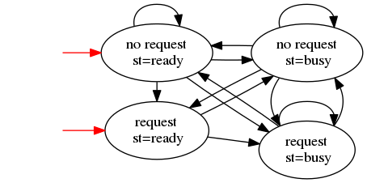

Joseph-Marie Valleix

24 février 2017

# Introduction à la vérification formelle
## TP1 : Model Checking

### Exercice 1: Prise en main
#### Q1

#### Q2 & Q3
Voir le fichier ex1.smv

On a les résultats suivants :

        SPEC AG(request -> AF state = busy)     -- True
        SPEC AG(request -> AF state = ready)    -- Fasle
        SPEC AG(request -> AG state = busy)     -- Fasle

        LTLSPEC G(request -> F state = busy)    -- True
        LTLSPEC G(request -> F state = ready)   -- Fasle
        LTLSPEC G(request -> G state = busy)    -- Fasle

### Exercice 2: Un premier modèle simple
#### Q1
Le modèle est implémenté dans les fichiers ex2{a, b, c}.smv

#### Q2
Voici résultats des formules CTL et LTL :

- `LTLSPEC G(a)` : specification is false

        -- as demonstrated by the following execution sequence
        Trace Description: LTL Counterexample
        Trace Type: Counterexample
          -> State: 1.1 <-
            a = TRUE
            b = FALSE
          -> State: 1.2 <-
            a = FALSE
          -- Loop starts here
          -> State: 1.3 <-
            b = TRUE
          -> State: 1.4 <-

- `LTLSPEC G(a U b)` : specification is false

        -- as demonstrated by the following execution sequence
        Trace Description: LTL Counterexample
        Trace Type: Counterexample
          -> State: 2.1 <-
            a = TRUE
            b = FALSE
          -> State: 2.2 <-
            a = FALSE
          -- Loop starts here
          -> State: 2.3 <-
            b = TRUE
          -> State: 2.4 <-

- `LTLSPEC a U X (a & !b)` : specification is false

        -- as demonstrated by the following execution sequence
        Trace Description: LTL Counterexample
        Trace Type: Counterexample
          -> State: 3.1 <-
            a = TRUE
            b = FALSE
          -> State: 3.2 <-
            a = FALSE
          -- Loop starts here
          -> State: 3.3 <-
            b = TRUE
          -> State: 3.4 <-

- `LTLSPEC X !b & G(!a | !b)` : specification is false

        -- as demonstrated by the following execution sequence
        Trace Description: LTL Counterexample
        Trace Type: Counterexample
          -> State: 4.1 <-
            a = TRUE
            b = FALSE
          -- Loop starts here
          -> State: 4.2 <-
            a = FALSE
            b = TRUE
          -> State: 4.3 <-

- `LTLSPEC X(a & b) & F(!a & !b)` : specification is false

        -- as demonstrated by the following execution sequence
        Trace Description: LTL Counterexample
        Trace Type: Counterexample
          -> State: 5.1 <-
            a = TRUE
            b = FALSE
          -- Loop starts here
          -> State: 5.2 <-
            a = FALSE
            b = TRUE
          -> State: 5.3 <-

- `SPEC EF EG a` : specification is true
- `SPEC EF EG b` : specification is true
- `LTLSPEC F ((G a) | (G b))` : specification is true

### Exercice 3 : Traversée de rivière
Voir le fichier ex3.smv

Il est effectivement possible de traverser la rivière malgré les contraintes avec la méthode suivante :

        -> State: 1.1 <-
            l = FALSE
            m = FALSE
            s = FALSE
            f = FALSE
            w = 50
            fm = TRUE
            mm = TRUE
            sm = TRUE
            lm = FALSE
          -> State: 1.2 <-
            m = TRUE
            s = TRUE
            f = TRUE
            w = 20
            mm = FALSE
          -> State: 1.3 <-
            s = FALSE
            f = FALSE
            w = 50
            sm = FALSE
            lm = TRUE
          -> State: 1.4 <-
            l = TRUE
            f = TRUE
            w = 30
            mm = TRUE
            lm = FALSE
          -> State: 1.5 <-
            m = FALSE
            f = FALSE
            w = 50
            sm = TRUE
          -> State: 1.6 <-
            m = TRUE
            s = TRUE
            f = TRUE

### Exercice 4 : Formules équivalentes
Voir le fichier ex4.smv

Voici les résultats obtenus:

- specification `(EF phi <-> EG phi)`  is false

        -- as demonstrated by the following execution sequence
        Trace Description: CTL Counterexample
        Trace Type: Counterexample
          -> State: 1.1 <-
            phi = FALSE
            psi = FALSE
            rho = FALSE
          -> State: 1.2 <-
            phi = TRUE

- specification `(EF phi <-> EF phi)`  is true
- specification `(AF !psi <-> !(EG psi))`  is true
- specification `(EF !psi <-> !(AF psi))`  is false

        -- as demonstrated by the following execution sequence
        Trace Description: CTL Counterexample
        Trace Type: Counterexample
          -> State: 2.1 <-
            phi = FALSE
            psi = TRUE
            rho = FALSE
          -> State: 2.2 <-
            psi = FALSE

- specification `((TRUE <-> AG phi) -> EG phi)`  is true
- specification `((TRUE <-> EG phi) -> AG phi)`  is false

        -- as demonstrated by the following execution sequence
        Trace Description: CTL Counterexample
        Trace Type: Counterexample
          -- Loop starts here
          -> State: 3.1 <-
            phi = TRUE
            psi = FALSE
            rho = FALSE
          -> State: 3.2 <-

- specification `((EF phi | EF psi) <-> EG (phi | psi))`  is false

        -- as demonstrated by the following execution sequence
        Trace Description: CTL Counterexample
        Trace Type: Counterexample
          -> State: 4.1 <-
            phi = FALSE
            psi = FALSE
            rho = FALSE
          -> State: 4.2 <-
            phi = TRUE

- specification `((AF phi | AF psi) <-> AF (phi | psi))`  is true
- specification `(A [ psi U A [ phi U rho ]  ]  <-> A [ A [ psi U phi ]  U rho ] )`  is true

### Exercice 5 : Algorithme auto-stabilisateur de Dtra (74)
#### Q1
Pour i > 0, dès que l'un des processus est en état critique, son état critique va se propager jusqu'à Pn. Lorsque Pn est en état critique, soit P0 sera lui aussi en état critique iau prochain tours car Pn va changer de valeur.

Par conséquent on a une succession constante de modification des drapeaux qui entraine des états critiques tournants.

#### Q2
Si `ci` indique que le processus i est critique, on s'attend à `G F ci` pour tout i.

#### Q3
On choisit 3 processus (les lignes du tableau `d` sont leurs drapeaux restectifs), `c` indique si leur états sont critiques.

Voir le fichier ex5.smv

#### Q4
Avec N = 3 et K = 1 par exemple on a la trace suivante :

        -> State: 1.1 <-
          d[0] = 1
          d[1] = 0
          d[2] = 0
          c2 = FALSE
          c1 = TRUE
          c0 = FALSE
          K = 1
        -> State: 1.2 <-
          d[1] = 1
          c2 = TRUE
          c1 = FALSE
        -> State: 1.3 <-
          d[2] = 1
          c2 = FALSE
          c0 = TRUE
        -> State: 1.4 <-
          d[0] = 0
          c1 = TRUE
          c0 = FALSE
        -> State: 1.5 <-
          d[1] = 0
          c2 = TRUE
          c1 = FALSE
        -- Loop starts here
        -> State: 1.6 <-
          d[2] = 0
          c2 = FALSE
          c0 = TRUE
        -> State: 1.7 <-

